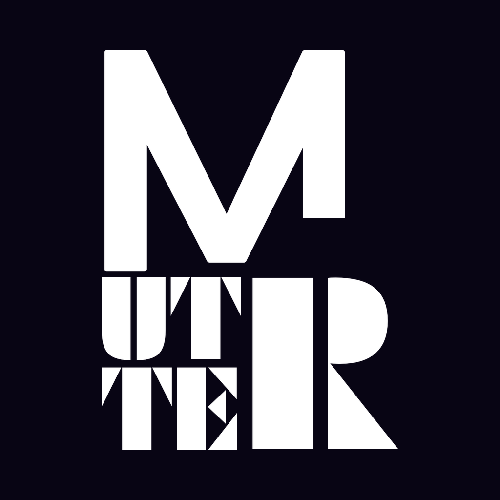

  

# MUTTER

Hold a key, speak, release — your words appear typed at the cursor. Local Whisper, no cloud.

| Platform | Where | Status |
|---|---|---|
| **Mac** — hold **fn / 🌐** | [mac-native/](mac-native/) | headless native Rust daemon — supersedes the Python daemon in [mac/](mac/) |
| **Android** — hold **volume-down** | [android/](android/) | live (APK) |
| **iOS** | [ios/](ios/) | not started |

The Mac daemon behaves exactly like the old Python daemon ([mac/](mac/)) — invisible background agent, hold fn to dictate — but rebuilt on the two low-level choices that made it robust (self-healing fn event-tap; non-deadlocking cpal audio teardown), and none of the GUI. Shared STT service is the ASR brain. Rationale + install: [mac-native/README.md](mac-native/README.md). (An earlier attempt vendored the [Handy](https://github.com/cjpais/Handy) Tauri app in `desktop/`; superseded — only the two robustness choices were worth keeping.)

Install (Mac): `cd mac-native && ./install.sh`

Decisions: cross-platform in [DECISIONS.md](DECISIONS.md), per-platform in each subproject.
